# Foundations: Agentic AI vs AI Agents

## 📝 Key Definitions

**AI Agent**: A software program designed to understand its environment, process information, and take actions to achieve specific goals. Operates independently within defined parameters using rule-based systems or machine learning models.

**Agentic AI**: Artificial intelligence systems featuring autonomous decision-making, goal-driven actions, learning capabilities, and advanced reasoning. Employs multiple agents to handle complex workflows, learning and adapting in real-time.

## 🔧 Core Characteristics

**AI Agents:**
- Handle specific, well-defined tasks
- Operate within predefined frameworks
- Can adapt based on learned patterns
- Examples: Chatbots, automated scheduling assistants, password reset systems

**Agentic AI:**
- Orchestrates multiple AI agents simultaneously
- Makes complex, multi-step decisions autonomously
- Learns and improves from interactions in real-time
- Proactively identifies and pursues strategic goals

## 🤖 Types of AI Agents Identified
1. **Learning Agents** - Adapt based on experience (e.g., customer service chatbots)
2. **Utility-based Agents** - Make decisions by weighing outcomes (e.g., AI trading systems)
3. **Goal-based Agents** - Focus on specific objectives (e.g., inventory management)
4. **Reflex Agents** - React to inputs using set rules (e.g., smart thermostats)
5. **Model-based Agents** - Use internal environment representation for decisions

## 📊 The AI vs Rule-Based Spectrum

**📊 Classification Framework:**

| System Type | Intelligence Level | Characteristics | Examples |
|-------------|-------------------|-----------------|----------|
| **Pure Rule-Based** | None | Fixed logic, no learning | Traditional if-then systems, basic automation |
| **Smart Rule-Based** | Low | Rules + basic analytics | Business process automation with conditions |
| **Reflex Agents** | Low-Medium | Direct sensor-to-action mapping | Vacuum cleaners, simple game AI |
| **Goal-Based Agents** | Medium | State + goal planning | Pathfinding robots, route optimization |
| **Utility-Based Agents** | Medium | Decision optimization via utility functions | Self-driving cars, trading algorithms |
| **Classical AI Agents** | Medium-High | Perception + Learning + Memory + Adaptation (no LLM) | Reinforcement learning bots, recommendation systems, adaptive control |
| **Hybrid AI Agents** | Medium | Rules + ML models | Chatbots with NLP + business rules |
| **LLM-Based Agents** | High | Natural language + reasoning | GPT-powered assistants, conversational AI |
| **Adaptive AI Agents** | High | Learning + reasoning | Advanced recommendation systems, predictive agents |
| **Agentic AI Systems** | Very High | Multi-agent coordination + learning | Enterprise automation platforms |

**🔍 Key Distinguishing Factors:**
- **Learning Capability**: Can the system improve from experience?
- **Pattern Recognition**: Does it identify complex patterns in data?
- **Contextual Awareness**: Can it adapt behavior based on situation?
- **Uncertainty Handling**: How does it deal with incomplete information?
- **Goal Optimization**: Does it actively work toward objectives vs just following steps?

## 🧩 Critical Distinction: Adaptation vs Rules

### The Core Difference: Learning from Experience

The fundamental difference between rule-based systems and true AI agents becomes clear when they encounter changing conditions that require adaptation. This is where the "intelligence" truly shows.

### Rule-Based Thermostat Limitations

Our rule-based thermostat has these **rigid constraints**:
- **Fixed temperature**: Always targets 20°C regardless of user preferences
- **Simple logic**: If current temp < 20°C → turn on heat, else turn off
- **No memory**: Cannot remember user adjustments or comfort patterns
- **No adaptation**: Same behavior every day regardless of season or usage

**When conditions change → NO ADAPTATION (follows fixed rules only)**

### True AI Agent Thermostat Scenarios

Here are real-world scenarios where a rule-based system **fails** but our AI agent thermostat **intelligently adapts**:

#### Scenario 1: User Preference Learning
```
🔴 Rule-based: Always maintains 20°C regardless of user comfort
🟢 AI agent: Learns user frequently adjusts to 22°C → adapts target temperature
           Learning: Updates preferred temperature based on user behavior
```

#### Scenario 2: Time Pattern Recognition
```  
🔴 Rule-based: Same temperature 24/7 regardless of schedule
🟢 AI agent: Notices user prefers 18°C at night, 22°C during day → schedules accordingly
           Learning: Builds time-based temperature profiles from usage patterns
```

#### Scenario 3: Seasonal Adaptation
```
🔴 Rule-based: Fixed 20°C target regardless of outside conditions
🟢 AI agent: Adjusts for weather patterns and seasonal comfort changes
           Learning: Correlates outside temperature with user comfort preferences
```

#### Scenario 4: Energy Efficiency Learning
```
🔴 Rule-based: No consideration of energy usage or efficiency
🟢 AI agent: Learns optimal heating/cooling cycles to maintain comfort with less energy
           Learning: Balances user comfort with energy efficiency based on feedback
```

#### Scenario 5: Environmental Context Awareness
```
🔴 Rule-based: Same response regardless of room occupancy or activities
🟢 AI agent: Adapts temperature based on number of people, time of day, activities
           Learning: Builds contextual models for different usage scenarios
```

### Key Intelligence Indicators

Our AI thermostat agent demonstrates these capabilities (verified in `comparison_demo.py`):

1. **Pattern Recognition**: "User always adjusts temperature up in the evening - learn this pattern"
2. **Context Awareness**: "It's colder outside today - user will likely prefer slightly warmer indoor temperature"  
3. **Adaptive Learning**: "User comfort preferences have changed over time - update the model"
4. **Predictive Behavior**: "Based on schedule patterns, pre-heat before user arrives home"
5. **Continuous Improvement**: "Temperature control accuracy has improved 15% over 30 days of learning"

**🔬 Live Evidence from Demo Output:**
- **Memory System**: Agent maintains temperature history: `[14, 17, 16, 15, 21, 22, 20, 23, 22, 21]`
- **Adaptive Actions**: Recent actions tracked: `['Maintain', 'Turn ON Heater', 'Maintain', 'Turn ON AC', 'Turn ON Heater']`
- **Learning Rate**: System uses 0.1 learning rate to gradually adapt preferences
- **Context Recognition**: Same input (19°C) produces different responses based on learned context
- **System Properties**: `has_memory: True`, `can_learn: True`, `adaptable: True` vs rule-based `False` for all

### The Intelligence Test

**Rule-Based Thermostat**: 
- ❌ Rigid adherence to fixed temperature target (20°C)
- ❌ No consideration of user preferences or context  
- ❌ Same behavior regardless of season, time, or usage
- ❌ Cannot improve or adapt to changing needs

**True AI Agent Thermostat**:
- ✅ Intelligent temperature adaptation based on user behavior
- ✅ Pattern recognition in usage and comfort preferences
- ✅ Context-aware decisions (time, weather, occupancy)
- ✅ Learning from user adjustments to improve comfort and efficiency

### Industry Impact
- **82% of companies** plan to adopt AI agents in the next three years
- **65% of companies** currently use generative AI and AI agents
- **15% of daily work decisions** will be automated by agentic AI by 2028
- Leidos achieved **99% reduction** in mean time to resolution with agentic AI

## 🚀 The Agentic AI Revolution: What Changed?

### The Critical Question

**Q**: If AI agents existed since the 1980s (reinforcement learning, autonomous vehicles, game AI), what technological breakthroughs made the leap to powerful agentic AI possible?

**A**: Five converging technological breakthroughs transformed individual AI agents into sophisticated agentic AI systems:

### 1. **Large Language Models (LLMs) - The Communication Revolution** 🗣️
**What Changed**: Natural language understanding and generation at human-level quality
- **Before**: Agents communicated through APIs, databases, or simple interfaces
- **Now**: Agents can interpret complex human goals, explain reasoning, and coordinate using natural language
- **Impact**: Enables **goal translation** ("keep the office comfortable") → actionable plans
- **Example**: "Optimize building temperature for energy efficiency during the meeting" becomes a coordinated plan across HVAC, lighting, and occupancy sensors

### 2. **Massive API Ecosystem - The Integration Revolution** 🔌
**What Changed**: Ubiquitous APIs and cloud services for everything
- **Before**: Agents operated in isolated domains with limited external data
- **Now**: Real-time access to weather, energy prices, calendars, IoT devices, databases
- **Impact**: Enables **context awareness** across multiple systems simultaneously
- **Example**: Thermostat agent accesses weather forecasts, energy pricing, calendar schedules, and occupancy sensors to make optimal decisions

### 3. **Transformer Architecture - The Reasoning Revolution** 🧠
**What Changed**: Attention mechanisms enable sophisticated pattern recognition and planning
- **Before**: Limited to domain-specific algorithms and simple decision trees
- **Now**: Can process complex, multi-dimensional context and plan multi-step strategies
- **Impact**: Enables **strategic planning** beyond reactive responses
- **Example**: Understanding that "high energy costs + weather forecast + meeting schedule" requires a 3-hour pre-cooling strategy

### 4. **Cloud Computing & Edge Infrastructure - The Scale Revolution** ☁️
**What Changed**: Massive computational resources and distributed processing capabilities
- **Before**: Individual agents limited by local hardware constraints
- **Now**: Multiple agents can operate simultaneously with real-time coordination
- **Impact**: Enables **multi-agent orchestration** at enterprise scale
- **Example**: Building management system coordinates hundreds of sensors, HVAC units, lighting systems, and security devices in real-time

### 5. **Advanced Memory & Vector Databases - The Memory Revolution** 💾
**What Changed**: Long-term memory with semantic search and retrieval capabilities
- **Before**: Agents had simple state machines or basic learning algorithms
- **Now**: Persistent memory of patterns, preferences, and performance across time
- **Impact**: Enables **continuous learning** and **contextual adaptation**
- **Example**: Remembering "Meetings in Conference Room A always run over by 30 minutes" and proactively adjusting cooling schedules

### The Convergence Effect

**Individual Breakthroughs → Agentic AI Systems**:

```
Classical AI Agent (1990s):
Thermostat with learning algorithm
↓
+ LLMs = Natural language goal understanding
+ APIs = Weather, energy, calendar integration  
+ Transformers = Multi-step strategic planning
+ Cloud = Real-time coordination with other systems
+ Vector DB = Long-term pattern memory
↓ 
Agentic AI System (2020s):
"Ensure optimal comfort and energy efficiency 
across the entire building during the conference"
```

### What Makes 2020s Agentic AI Different

**Before (Individual AI Agents)**:
- ✅ Learning and adaptation within single domain
- ❌ Limited communication between systems
- ❌ Simple goal interpretation (temperature thresholds)
- ❌ Reactive to immediate conditions only
- ❌ Isolated memory and experience

**Now (Agentic AI Systems)**:
- ✅ **Goal Understanding**: Complex, multi-objective reasoning
- ✅ **System Orchestration**: Coordinating multiple specialized agents
- ✅ **Context Integration**: Multi-source real-time data synthesis
- ✅ **Strategic Planning**: Multi-step optimization across time
- ✅ **Natural Communication**: Human-AI collaboration in plain language
- ✅ **Persistent Intelligence**: Learning across sessions and contexts

### The Intelligence Multiplier

**Key Insight**: Agentic AI isn't just "better agents" - it's the **emergence of collective intelligence** when multiple AI agents coordinate through advanced communication, shared context, and strategic planning capabilities.

**Mathematical Analogy**:
- **Individual AI Agent**: 1 + 1 + 1 = 3 (additive capabilities)
- **Agentic AI System**: 1 × 1 × 1 = **Emergent Intelligence** (multiplicative, non-linear capabilities)

The combination of these five technological breakthroughs created the conditions for **emergent intelligence** - where the coordinated system exhibits capabilities that no individual agent possessed.

## 🎨 Visual Architecture Diagrams

### Intelligence Spectrum Visualization


### Agentic AI Thermostat Architecture



### Agentic Cycle Flow Diagram



### Comparison Matrix: Rule-Based vs AI Agent vs Agentic AI

```
📊 CAPABILITY COMPARISON MATRIX
═══════════════════════════════════════════════════════════════════════════════

┌───────────────────┬─────────────────┬─────────────────┬─────────────────────┐
│    CAPABILITY     │   RULE-BASED    │    AI AGENT     │     AGENTIC AI      │
├───────────────────┼─────────────────┼─────────────────┼─────────────────────┤
│ Goal Understanding│       ❌        │       ⚠️        │         ✅          │
│                   │ Fixed targets   │ Single targets  │ Complex objectives  │
├───────────────────┼─────────────────┼─────────────────┼─────────────────────┤
│ Learning Ability  │       ❌        │       ✅        │         ✅          │
│                   │ No adaptation   │ Pattern learning│ Multi-domain learn  │
├───────────────────┼─────────────────┼─────────────────┼─────────────────────┤
│ Memory System     │       ❌        │       ✅        │         ✅          │
│                   │ Stateless       │ Local memory    │ Comprehensive logs  │
├───────────────────┼─────────────────┼─────────────────┼─────────────────────┤
│ Context Awareness │       ❌        │       ⚠️        │         ✅          │
│                   │ No context      │ Limited context │ Multi-source data   │
├───────────────────┼─────────────────┼─────────────────┼─────────────────────┤
│ Planning Ability  │       ❌        │       ⚠️        │         ✅          │
│                   │ Reactive only   │ Simple planning │ Multi-step strategy │
├───────────────────┼─────────────────┼─────────────────┼─────────────────────┤
│ Tool Integration  │       ❌        │       ⚠️        │         ✅          │
│                   │ No external APIs│ Limited tools   │ Multiple APIs       │
├───────────────────┼─────────────────┼─────────────────┼─────────────────────┤
│ Adaptation Speed  │       ❌        │       ⚠️        │         ✅          │
│                   │ Never adapts    │ Gradual learning│ Real-time adjustment│
├───────────────────┼─────────────────┼─────────────────┼─────────────────────┤
│ User Communication│       ❌        │       ⚠️        │         ✅          │
│                   │ No feedback     │ Basic status    │ Intelligent dialogue│
├───────────────────┼─────────────────┼─────────────────┼─────────────────────┤
│ Energy Efficiency │       ❌        │       ⚠️        │         ✅          │
│                   │ No optimization │ Basic efficiency│ Multi-factor optim. │
├───────────────────┼─────────────────┼─────────────────┼─────────────────────┤
│ Predictive Action │       ❌        │       ❌        │         ✅          │
│                   │ Reactive only   │ Reactive        │ Proactive planning  │
└───────────────────┴─────────────────┴─────────────────┴─────────────────────┘

Legend: ✅ = Excellent    ⚠️ = Limited    ❌ = Not Available
```

---
*Part of: [Agentic AI vs AI Agents](README.md)*  
*Next: [DEMONSTRATIONS.md](DEMONSTRATIONS.md)*
