# Visual Diagrams

This folder contains externalized Mermaid diagrams for the Agentic AI vs AI Agents concept.

## Diagram Files

### 1. Intelligence Spectrum
**Source**: [intelligence-spectrum.mmd](intelligence-spectrum.mmd) | **Rendered**: [intelligence-spectrum.svg](intelligence-spectrum.svg)

Shows the progression from Rule-Based Systems → AI Agents → Agentic AI


### 2. Agentic AI Architecture  
**Source**: [agentic-ai-architecture.mmd](agentic-ai-architecture.mmd) | **Rendered**: [agentic-ai-architecture.svg](agentic-ai-architecture.svg)

Detailed architecture of an Agentic AI thermostat system


### 3. Agentic Cycle Flow
**Source**: [agentic-cycle-flow.mmd](agentic-cycle-flow.mmd) | **Rendered**: [agentic-cycle-flow.svg](agentic-cycle-flow.svg)

The five-step agentic cycle: Perceive → Reflect → Plan → Execute → Learn


### 4. Technological Breakthroughs Convergence ⭐ NEW
**Source**: [technological-breakthroughs.mmd](technological-breakthroughs.mmd) | **Documentation**: [technological-breakthroughs.md](technological-breakthroughs.md)

Visualizes how five key technological breakthroughs converged to enable Agentic AI



### 5. Adaptation vs Rules Decision Tree ⭐ NEW
**Source**: [adaptation-decision-tree.mmd](adaptation-decision-tree.mmd) | **Documentation**: [adaptation-decision-tree.md](adaptation-decision-tree.md)

Decision tree for choosing Rule-Based vs AI Agent vs Agentic AI systems



### 6. Learning Capability Comparison ⭐ NEW
**Source**: [learning-capability-comparison.mmd](learning-capability-comparison.mmd) | **Documentation**: [learning-capability-comparison.md](learning-capability-comparison.md)

Side-by-side comparison of learning capabilities across system types



### 7. Multi-Agent Coordination Architecture ⭐ NEW
**Source**: [multi-agent-coordination.mmd](multi-agent-coordination.mmd) | **Documentation**: [multi-agent-coordination.md](multi-agent-coordination.md)

Shows how specialized agents coordinate in Agentic AI systems



### 8. Context Awareness Layers ⭐ NEW
**Source**: [context-awareness-layers.mmd](context-awareness-layers.mmd) | **Documentation**: [context-awareness-layers.md](context-awareness-layers.md)

Visualizes the multi-layer context processing system in Agentic AI



## How to View

### SVG Files (Recommended)
- **Direct Viewing**: Open `.svg` files directly in any web browser
- **Documentation**: Embed SVG files directly in markdown for universal compatibility
- **Print Ready**: SVG files are vector-based and scale perfectly for presentations
- **No Dependencies**: Work everywhere without requiring Mermaid extensions

### Mermaid Source Files (.mmd)
- **VS Code**: Install "Mermaid Preview" extension and open `.mmd` files
- **Online Editor**: Copy Mermaid code and paste into [Mermaid Live Editor](https://mermaid.live)
- **Editing**: Modify `.mmd` files and regenerate SVGs using `mmdc -i file.mmd -o file.svg`

## Diagram Categories

### Core Architecture Diagrams
- **Intelligence Spectrum**: Foundational classification system
- **Agentic AI Architecture**: Technical system design
- **Agentic Cycle Flow**: Process workflow visualization

### Advanced Conceptual Diagrams ⭐ NEW
- **Technological Breakthroughs**: Historical context and convergence analysis
- **Adaptation Decision Tree**: Practical system selection guidance
- **Learning Capability Comparison**: Feature comparison matrix
- **Multi-Agent Coordination**: System interaction patterns
- **Context Awareness Layers**: Information processing architecture

## Diagram Types

All diagrams use Mermaid syntax with:
- **Flowcharts**: For process flows and decision trees
- **Block Diagrams**: For comparison matrices and structured layouts
- Color-coded components for visual clarity
- Emoji icons for better identification
- Professional styling for documentation quality
- Interactive elements when rendered properly

## File Formats

- **`.mmd`**: Source Mermaid files for editing and version control
- **`.svg`**: Rendered vector graphics for universal display and embedding
- **Workflow**: Edit `.mmd` → Generate `.svg` → Embed in documentation

## Regenerating SVGs

To update SVG files after editing Mermaid source:
```bash
# Install Mermaid CLI (if not already installed)
npm install -g @mermaid-js/mermaid-cli

# Convert individual files
mmdc -i intelligence-spectrum.mmd -o intelligence-spectrum.svg
mmdc -i agentic-ai-architecture.mmd -o agentic-ai-architecture.svg
mmdc -i agentic-cycle-flow.mmd -o agentic-cycle-flow.svg

# Or convert all at once
for file in *.mmd; do mmdc -i "$file" -o "${file%.mmd}.svg"; done
```
