# OpenAI Agent Building Guide
*Practical Guide to Building Intelligent Agents - Official OpenAI Framework*

---
*Part of: [GenAI Learning Lab](../../README.md)*  
*Navigation: [FOUNDATIONS](FOUNDATIONS.md) | [DEMONSTRATIONS](DEMONSTRATIONS.md) | [APPLICATIONS](APPLICATIONS.md)*

---

## 🎯 Learning Objectives

By the end of this concept exploration, you will:

- **Understand** the fundamental characteristics that define an agent vs. simple LLM applications
- **Master** the three core components of agent architecture: Model, Tools, and Instructions
- **Apply** orchestration patterns for both single-agent and multi-agent systems
- **Implement** comprehensive guardrails and safety mechanisms
- **Design** production-ready agents with proper human intervention protocols

## 🚀 Quick Start

### Prerequisites
- Python 3.8+
- OpenAI API access
- Basic understanding of LLMs and APIs

### Installation
```bash
cd concepts/openai-agent-building-guide
python -m venv venv
source venv/bin/activate  # On Windows: venv\Scripts\activate
pip install -r requirements.txt
```

### Run Live Demonstrations
```bash
# Basic agent demo
python demo/basic_agent_demo.py

# Multi-agent orchestration patterns
python demo/orchestration_demo.py

# Safety guardrails system
python demo/safety_guardrails_demo.py

# Decision framework (interactive)
python demo/workflow_decision_demo.py

# Guardrails in action
python demo/guardrails_demo.py
```

## 📊 Agent vs. Application Comparison

| Aspect | Traditional LLM App | OpenAI Agent |
|--------|-------------------|--------------|
| **Control Flow** | User-driven interactions | Independent workflow execution |
| **Decision Making** | Single-turn responses | Multi-step reasoning & planning |
| **Tool Usage** | Fixed function calls | Dynamic tool selection |
| **Error Handling** | Manual intervention required | Self-correction & recovery |
| **Complexity** | Simple Q&A patterns | Complex workflow automation |

## 🏗️ Agent Architecture Overview



*Interactive architecture diagram showing the core components and layers of OpenAI agents*

## 📚 Learning Path

### 1. **Foundations** ([FOUNDATIONS.md](FOUNDATIONS.md))
- Agent definition and characteristics
- When to build agents vs. traditional automation
- Core components deep dive
- Model selection strategies

### 2. **Demonstrations** ([DEMONSTRATIONS.md](DEMONSTRATIONS.md))
- Working code examples with OpenAI Agents SDK
- Single-agent implementation patterns
- Multi-agent orchestration (Manager & Decentralized)
- Guardrails implementation
- Real execution outputs and analysis

### 3. **Applications** ([APPLICATIONS.md](APPLICATIONS.md))
- Enterprise use cases and deployment strategies
- Production considerations and best practices
- Human-in-the-loop integration
- Scale and performance optimization

## 🛠️ Key Use Cases for Agents

### ✅ **Ideal for Agents**
- **Complex Decision-Making**: Nuanced judgment, exceptions, context-sensitive decisions
- **Difficult-to-Maintain Rules**: Unwieldy rulesets that are costly to update
- **Unstructured Data Heavy**: Natural language interpretation, document processing

### ❌ **Not Suitable for Agents**
- Simple chatbots or Q&A systems
- Single-turn LLM applications
- Well-defined deterministic workflows
- Real-time low-latency requirements

## 🔒 Safety & Guardrails

### Critical Protection Layers
1. **Input Validation**: Relevance classifiers, safety filters, PII detection
2. **Tool Safeguards**: Risk assessment (low/medium/high), approval workflows
3. **Output Validation**: Brand alignment, content safety checks
4. **Human Intervention**: Failure thresholds, high-risk action triggers

## 📁 Project Structure

```
openai-agent-building-guide/
├── README.md              # This file - Navigation hub
├── FOUNDATIONS.md         # Core concepts and theory
├── DEMONSTRATIONS.md      # Working code examples
├── APPLICATIONS.md        # Real-world use cases
├── requirements.txt       # Python dependencies
├── demo/                  # Live demonstration code
│   ├── basic_agent_demo.py
│   ├── orchestration_demo.py
│   ├── safety_guardrails_demo.py
│   ├── workflow_decision_demo.py
│   ├── run_all_demos.py
│   └── README.md
├── diagrams/             # Architecture visualizations
│   ├── agent-architecture.mmd    # Core agent architecture
│   ├── agent-architecture.svg    # Generated SVG
│   ├── orchestration-patterns.mmd    # Multi-agent patterns
│   ├── orchestration-patterns.svg    # Generated SVG  
│   ├── safety-guardrails.mmd    # 3-tier safety system
│   ├── safety-guardrails.svg    # Generated SVG
│   ├── workflow-decision-tree.mmd    # Decision framework
│   ├── workflow-decision-tree.svg    # Generated SVG
│   └── README.md
└── resources/            # Auxiliary files and scripts
    ├── extraction/       # PDF content and source materials
    │   ├── openai-agent-guide.pdf
    │   ├── openai_agent_guide_content_full.txt
    │   └── openai_agent_guide_content_structured.json
    ├── scripts/          # Utility scripts
    │   ├── extract_pdf.py
    │   └── generate_svgs.sh
    └── README.md
```

### 🎨 Working with Diagrams

Generate SVG files from Mermaid diagrams:
```bash
./resources/scripts/generate_svgs.sh
```

**Important**: Always reference SVG files in documentation, not Mermaid code blocks.

## 🎓 Success Metrics

After completing this concept, you should be able to:

- [ ] Define what makes a system an "agent" vs. a simple LLM application
- [ ] Choose appropriate orchestration patterns for your use case
- [ ] Implement comprehensive safety mechanisms
- [ ] Design production-ready agents with proper monitoring
- [ ] Identify when agents are (or aren't) the right solution

## 🔗 Related Concepts

- **[Agentic AI vs AI Agents](../agentic-ai-vs-ai-agents/)** - Foundational distinctions and intelligence spectrum
- **Multi-Agent Systems** (Coming soon)
- **Model Context Protocol (MCP)** (Coming soon)
- **LangChain vs OpenAI Agents** (Coming soon)

## 📖 Source Material

This concept is based on OpenAI's official "A Practical Guide to Building Agents" (34 pages), distilling insights from numerous customer deployments into actionable best practices.

---

**Next Steps**: Start with [FOUNDATIONS.md](FOUNDATIONS.md) to understand the core concepts, then proceed to [DEMONSTRATIONS.md](DEMONSTRATIONS.md) for hands-on implementation.
