# OpenAI Agent Building Guide - Diagrams

This directory contains visual representations of key concepts from the OpenAI Agent Building Guide, implemented as Mermaid diagrams with generated SVG files.

## � Visual Diagrams

This directory contains comprehensive visual diagrams that illustrate key concepts from the OpenAI Agent Building Guide. The diagrams are organized into simple overview diagrams and detailed exploration diagrams to provide both quick understanding and deep insights.

### 🎯 Core Overview Diagrams (Simple & Clear)

#### 1. **Agent Architecture** (`agent-architecture.mmd/.svg`)
**Purpose**: Simple overview of how agents work  
**Shows**: User → Agent → Tools → Guardrails → Response  
**Best for**: Quick understanding, presentations, introductions

#### 2. **Safety Guardrails** (`safety-guardrails.mmd/.svg`)
**Purpose**: Basic safety validation flow  
**Shows**: Input check → Tool safety → Output validation  
**Best for**: Safety overview, risk discussions

#### 3. **Decision Tree** (`workflow-decision-tree.mmd/.svg`)
**Purpose**: When to use which automation approach  
**Shows**: 4-step decision process for automation choice  
**Best for**: Project planning, architecture decisions

### 🔍 Detailed Exploration Diagrams

#### 4. **Agent Orchestration Patterns** (`agent-orchestration-patterns.mmd/.svg`)
**Purpose**: Deep dive into multi-agent architectures  
**Shows**: Single Agent vs Manager Pattern vs Handoff Pattern  
**Best for**: Architecture planning, system design

#### 5. **Detailed Safety System** (`detailed-safety-system.mmd/.svg`)
**Purpose**: Comprehensive safety implementation  
**Shows**: 3-tier safety validation with risk levels and human oversight  
**Best for**: Security planning, compliance discussions

#### 6. **Implementation Examples** (`implementation-examples.mmd/.svg`)
**Purpose**: Real-world examples and risk assessment  
**Shows**: Concrete examples, risk indicators, readiness checklist  
**Best for**: Project evaluation, stakeholder discussions

### 🚀 Quick Reference

| Diagram | Complexity | Use Case | Target Audience |
|---------|------------|----------|-----------------|
| Agent Architecture | ⭐ Simple | Overview & Introduction | All stakeholders |
| Safety Guardrails | ⭐ Simple | Safety basics | Security teams |
| Decision Tree | ⭐ Simple | Choosing approach | Product managers |
| Orchestration Patterns | ⭐⭐ Detailed | System architecture | Engineers |
| Detailed Safety | ⭐⭐ Detailed | Security implementation | Security architects |
| Implementation Examples | ⭐⭐ Detailed | Project planning | Project teams |

## 🎨 Usage in Documentation

All diagrams are referenced as SVG files in the documentation:

```markdown



```

## 🔧 Regenerating SVGs

To regenerate all SVG files from Mermaid sources:

```bash
cd diagrams/
mmdc -i agent-architecture.mmd -o agent-architecture.svg
mmdc -i safety-guardrails.mmd -o safety-guardrails.svg
mmdc -i workflow-decision-tree.mmd -o workflow-decision-tree.svg
mmdc -i agent-orchestration-patterns.mmd -o agent-orchestration-patterns.svg
mmdc -i detailed-safety-system.mmd -o detailed-safety-system.svg
mmdc -i implementation-examples.mmd -o implementation-examples.svg
```

## 📐 Diagram Design Principles

### Visual Hierarchy
- **🔵 Blue**: User interaction points
- **🟢 Green**: Safe operations and validation
- **🟡 Orange**: Tool operations and medium risk
- **🔴 Red**: Blocked operations and high risk
- **🟣 Purple**: Core agent logic and coordination
- **⚫ Gray**: External systems and infrastructure

### Flow Patterns
- **Solid arrows**: Primary workflow paths
- **Dotted arrows**: Monitoring and feedback loops
- **Labeled edges**: Decision criteria and conditions
- **Subgraphs**: Logical component groupings

### Content Strategy
- **Emojis**: Instant visual recognition
- **Multi-line labels**: Detailed context without clutter
- **Decision diamonds**: Clear branching logic
- **Color coding**: Consistent risk and component classification

---

*Generated from the OpenAI Agent Building Guide concept. Each diagram supports both educational understanding and practical implementation reference.*
